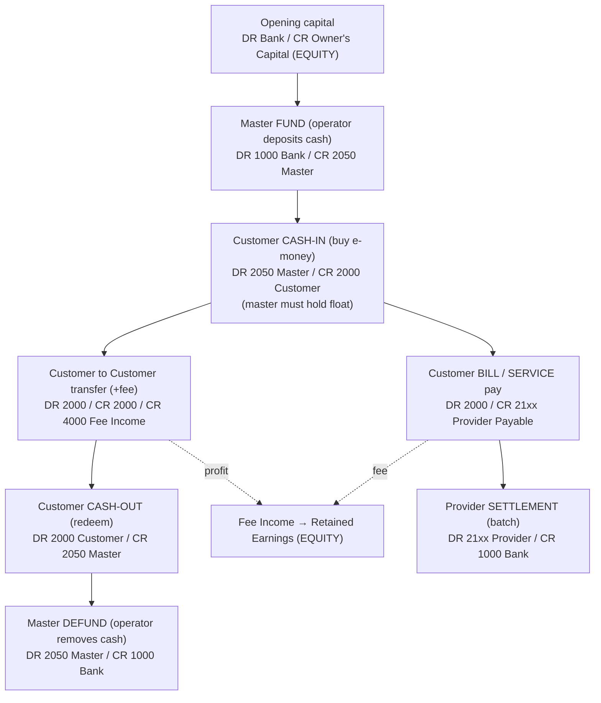

# E-Wallet Accounting — Workflow Plan & Accounting Model

> Status: Implemented (master-float model, aggregate ledger, no merchant).
> Bill / service payments (section 11 + `BILL_SERVICE_ACCOUNTING_WORKFLOW_PLAN.md`):
> **planned** — per-provider payable accounts, two-step settlement.
> Scope: chart of accounts, double-entry model, and transaction workflows for the
> two-tier wallet system (pre-funded Master float + Customer wallets).
> Audience: backend engineers building the posting engine, and reviewers
> validating that debit/credit entries balance.

---

## 1. Concept overview

The platform operates like a closed-loop e-money issuer with a **pre-funded master float**:

- **Real cash** lives in a **Bank account (Asset)** and **backs all e-money 1:1**.
- **Every wallet** (master and customer) is a **Liability account** — e-money is
  value the platform *owes* and must be redeemable for cash.
- The **Master wallet** is a system-owned **float that holds a real balance**. The
  operator funds it with cash (`DR Bank / CR Master`) and can withdraw cash from it
  (`DR Master / CR Bank`).
- **Customer cash-in / cash-out move e-money between the master float and the
  customer only** — the bank does **not** move on a customer buy/redeem; it moved
  when the operator funded the master.
- There is **no merchant** in this model — all customer wallets share one aggregate
  liability account.
- The platform **earns only from fees** (Income). Selling balance is a fair
  exchange at par and produces **no profit**.
- **Opening capital** the operator injects is **Equity (Owner's Capital)** —
  separate from the e-money float.

### Ledger granularity

We keep an **aggregate ledger**: one `2000 Customer Wallet Liability` account for all
customer wallets, plus a dedicated `2050 Master Wallet Liability` account for the
master float. Per-wallet history lives in `wallet_transactions` (keyed by `wallet_id`),
not in separate chart-of-accounts rows.

### The golden invariant

```
Bank cash (Asset)  ==  Master float (2050)
                     +  Σ customer balances (2000)
                     +  Σ provider payables (2110–2199)        [after bill accrual, before settlement]

A  ==  L + E + (Income − COGS − Expenses)                    [whole-system balance]
```

After a provider is **settled** from bank, its payable returns to zero and bank
drops by the same amount — the customer e-money has fully exited the closed loop.

### High-level flow



---

## 2. Why the Master wallet is a LIABILITY (not an asset)

This is the single most important design decision.

- A **user wallet is a liability** (redeemable value owed to the user).
- A wallet-to-wallet transfer must be a clean 2-line entry: `DR one / CR other`.
- For that to balance, **both sides must be the same account type**.
- If `master = Asset` and `user = Liability`, then "master sends to user" becomes
  *credit-an-asset + credit-a-liability = two credits = does not balance*.

Therefore the **master wallet is a Liability (`2050`)** — the operator's pre-funded
e-money float that issues to and redeems from customers. Self-issued e-money in the
operator's own hands is never booked as an asset or as profit.

---

## 3. Chart of accounts

Grouped by code range (`1xxx` Assets, `2xxx` Liabilities, `3xxx` Equity,
`4xxx` Income, `5xxx` COGS, `6xxx` Expenses). System/platform accounts use
`created_by = 0`.

| Code | Account | Type | Normal balance | Purpose |
|------|---------|------|----------------|---------|
| 1000 | Bank / Cash | Asset | Debit | Real money that backs all e-money |
| 1010 | eWallet Float | Asset | Debit | (optional) in-transit funds |
| 2000 | **Customer Wallet Liability** | Liability | Credit | Aggregate balance owed to all customer wallets |
| 2050 | **Master Wallet Liability** | Liability | Credit | The master float (system-owned, holds a real balance) |
| 2100 | Third Party Payables (control) | Liability | Credit | (optional) parent/summary for provider payables |
| 2110–2199 | **Provider Payable — one per partner** | Liability | Credit | Money owed to each external bill/service provider |
| 2900 | Fees / Tax Payable | Liability | Credit | (optional) money owed to tax authority |
| 3000 | Owner's Capital | Equity | Credit | Operator's injected opening capital |
| 3900 | Retained Earnings | Equity | Credit | Accumulated profit from P&L |
| 4000 | Fee Income | Income | Credit | Transaction fees charged |
| 5000 | Processing Cost | COGS | Debit | (optional) per-transaction cost |
| 6000 | Operating Expense | Expense | Debit | General running costs |

All customer wallets post to the **aggregate** `2000` account; the master wallet
posts to `2050`. Per-wallet detail is tracked in `wallet_transactions` (keyed by
`wallet_id`), not in per-wallet chart-of-accounts rows. There is no merchant account.

**Bill / service providers** are the exception: each external partner (electricity,
telecom, etc.) gets its **own** liability account in the `2110–2199` range, linked
from the `partners` record via `account_id`. Postings always hit that provider's
account — never a shared “generic” payable for all third parties.

### Normal balances (per `AccountBalanceService::isDebitNormal()`)

| Type | Normal balance | Signed balance |
|------|---------------|----------------|
| Assets, Expenses, COGS | Debit | `debit − credit` |
| Liabilities, Equity, Income | Credit | `credit − debit` |

---

## 4. The five invariants of a valid entry

Every posting must satisfy all five (enforced by the posting engine):

1. At least one line.
2. Every line has `debit ≥ 0` and `credit ≥ 0` (no negatives).
3. A line has **either** a debit **or** a credit, never both.
4. A line is not zero/zero.
5. **Sum(debits) == Sum(credits)** rounded to 2 decimals — the entry balances.

Plus the system-level check: `Assets == Liabilities + Equity + (Income − COGS − Expenses)`.

---

## 5. Transaction workflows (journal entries)

### 5.1 Opening balance — operator funds the business (Equity)

The operator's own injected money is the **opening balance = Owner's Capital (Equity)**.
It is the operator's cushion/working capital and is **separate** from the e-money float.

```
Entry: OPEN-001 (operator starts with 1000 of own money)
  DR  1000 Bank (Asset)              1000.00
  CR  3000 Owner's Capital (Equity)  1000.00
```

Opening balance sheet:

| Assets | | Liabilities + Equity | |
|--------|---:|--------|---:|
| Bank | 1000 | Owner's Capital (Equity) | 1000 |
| **Total** | **1000** | **Total** | **1000** |

`A 1000 = L 0 + E 1000` ✅

---

### 5.2 Master FUND — operator pre-funds the float with cash

Before the operator can sell e-money, they deposit real cash to back the float.
This is the only customer-facing-cash step that touches the bank.

```
Entry: FUND-001 (operator funds master with 1000)
  DR  1000 Bank (Asset)                 1000.00
  CR  2050 Master Wallet (Liability)    1000.00
```

Balance sheet after funding (assuming 1000 opening capital):

| Assets | | Liabilities + Equity | |
|--------|---:|--------|---:|
| Bank | 2000 | Master float (2050) | 1000 |
| | | Owner's Capital | 1000 |
| **Total** | **2000** | **Total** | **2000** |

`A 2000 = L 1000 + E 1000` ✅

---

### 5.3 Customer CASH-IN — Master issues e-money to a customer

The customer pays the operator cash at the station; the operator resells e-money
from the **already-funded** float. E-money moves master → customer; the bank does
**not** move (the cash backing was deposited at FUND time, and the customer's
payment replenishes the operator's advance).

```
Entry: BUY-001 (customer buys 200)
  DR  2050 Master Wallet (Liability)    200.00
  CR  2000 Customer Wallet (Liability)  200.00
```

**Guard:** the master float must hold at least 200. **No income** — fair swap at par.

Balance sheet after the buy:

| Assets | | Liabilities + Equity | |
|--------|---:|--------|---:|
| Bank | 2000 | Master float (2050) | 800 |
| | | Customer wallets (2000) | 200 |
| | | Owner's Capital | 1000 |
| **Total** | **2000** | **Total** | **2000** |

`A 2000 = L 1000 + E 1000` ✅ (float just shifted from master to customer)

---

### 5.4 Customer → Customer transaction (with fee)

The only place value leaves the liability pool and becomes platform earnings.
Both customer sides hit the **aggregate** `2000` account.

```
Entry: PAY-001 (Customer A pays Customer B 50, with a 2 fee)
  DR  2000 Customer Wallet (Liability)  50.00
  CR  2000 Customer Wallet (Liability)  48.00
  CR  4000 Fee Income (Income)           2.00
```

- ✅ `50 == 48 + 2` → balanced.
- ⚠️ The fee **must** credit **Fee Income (4000)**, never another wallet/liability.
  An entry that "balances" but books the fee to a liability silently corrupts the
  P&L — correct account *type*, not just balanced amounts.

Net on `2000`: `−50 + 48 = −2` (total customer e-money drops by the fee, which becomes income).

---

### 5.5 Customer CASH-OUT — customer redeems back to the master

Mirror of the buy. The customer returns e-money to the master; the operator hands
over cash from the float they hold. E-money moves customer → master; the bank does
**not** move here.

```
Entry: WD-001 (customer redeems 48)
  DR  2000 Customer Wallet (Liability)  48.00
  CR  2050 Master Wallet (Liability)    48.00
```

**Guard:** the customer wallet must hold at least 48.

---

### 5.6 Master DEFUND — operator withdraws cash from the float

```
Entry: DEFUND-001 (operator withdraws 300 from the float)
  DR  2050 Master Wallet (Liability)    300.00
  CR  1000 Bank (Asset)                 300.00
```

**Guard:** the master float must hold at least 300. This is the mirror of FUND.

---

### 5.7 Bill / service payment — customer pays a third-party provider (accrual)

When a customer pays a bill or buys a service offered by an **external partner** from
their wallet, e-money leaves the customer pool and becomes an **amount owed to that
specific provider**. The bank does **not** move yet — settlement to the provider
happens later (section 5.8).

This is **not** a wallet transfer (no recipient wallet) and **not** cash-out (money
does not return to the master float).

**One payable account per provider** — e.g. partner “Electricity Co” → `2110`,
partner “Telecom Co” → `2120`. Never post all providers to one shared account.

```
Entry: BILL-001 (customer pays Electricity Co bill 100)
  DR  2000 Customer Wallet (Liability)       100.00
  CR  2110 Provider Payable — Electricity Co 100.00
```

With a platform fee (same rule as transfer — fee to Income, never to a liability):

```
Entry: BILL-002 (bill 100 + 2 fee to Electricity Co)
  DR  2000 Customer Wallet (Liability)       102.00
  CR  2110 Provider Payable — Electricity Co 100.00
  CR  4000 Fee Income (Income)                 2.00
```

- ✅ `102 == 100 + 2` → balanced.
- ⚠️ Fee **must** credit **Fee Income (4000)**, not the provider payable.
- **Guard:** customer wallet balance ≥ amount + fee *before* calling the partner API.
- **Guard:** post the ledger **only after** the partner API confirms success (or use
  a pending → completed state machine; failed calls must not debit the wallet).

Balance sheet after BILL-001 (continuing from section 5.3: Bank 2000, Master 800,
Customer 200, Equity 1000):

| Assets | | Liabilities + Equity | |
|--------|---:|--------|---:|
| Bank | 2000 | Master float (2050) | 800 |
| | | Customer wallets (2000) | 100 |
| | | Provider payable — Elec. (2110) | 100 |
| | | Owner's Capital | 1000 |
| **Total** | **2000** | **Total** | **2000** |

`A 2000 = L 1000 + E 1000` ✅ — customer liability shifted to provider payable;
bank unchanged until settlement.

Net on `2000`: decreases by bill amount + fee. Provider payable increases by bill
amount only; fee becomes income.

---

### 5.8 Provider settlement — operator pays the third party from bank

When the operator batches payment to a provider (daily/weekly wire, API settlement,
etc.), cash leaves the bank and clears that provider's payable.

```
Entry: SETTLE-001 (pay Electricity Co 100 owed)
  DR  2110 Provider Payable — Electricity Co  100.00
  CR  1000 Bank (Asset)                     100.00
```

- **Guard:** provider payable balance ≥ settlement amount.
- Each settlement posts only to **that provider's** `21xx` account.
- Partial settlements are allowed (pay 60 now, 40 later) — each entry reduces the
  payable and bank by the same amount.

Balance sheet after SETTLE-001:

| Assets | | Liabilities + Equity | |
|--------|---:|--------|---:|
| Bank | 1900 | Master float (2050) | 800 |
| | | Customer wallets (2000) | 100 |
| | | Provider payable — Elec. (2110) | 0 |
| | | Owner's Capital | 1000 |
| **Total** | **1900** | **Total** | **1900** |

`A 1900 = L 900 + E 1000` ✅ — e-money fully exited: customer spent 100, bank paid
100 to the external provider.

**Combined lifecycle (BILL-001 + SETTLE-001):**

| Step | Customer (2000) | Provider (2110) | Bank (1000) | Fee Income |
|------|----------------:|----------------:|------------:|-----------:|
| After cash-in (5.3) | +200 | 0 | 2000 | 0 |
| After BILL-001 | +100 | +100 | 2000 | 0 |
| After SETTLE-001 | +100 | 0 | 1900 | 0 |

---

### 5.9 Provider onboarding — chart-of-account setup

When a new bill/service partner is added to the platform:

1. Create a **Liability** account in `2110–2199` (unique `code`, e.g. `2110`).
2. Name it clearly: `Provider Payable — {Partner Name}`.
3. Set `created_by = 0` (system account); `type` = Liabilities; correct `sub_type`
   for balance-sheet grouping.
4. Store the link on the partner record: `partners.account_id → chart_of_accounts.id`.
5. Reject bill-payment requests if the partner has no linked payable account.

Suggested code allocation:

| Code | Partner (example) |
|------|-------------------|
| 2110 | Electricity Co |
| 2120 | Telecom Co |
| 2130 | Water Utility |
| 2140+ | Next partners |

Reserve `2100` as an optional control/summary parent; operational postings use the
per-partner child accounts (`2110+`).

---

## 6. What is — and is NOT — your money

| Account | What it really is |
|---------|-------------------|
| **Master wallet balance** | A **liability** — pre-funded, un-issued float. Not your money, not profit. |
| **Customer wallet balances** | **Liabilities** — money owed to users, backed 1:1 by bank cash. |
| **Owner's Capital (3000)** | Your **opening balance / equity** — your own injected money. |
| **Actual profit** | Lives in **Fee Income (4000)** → rolls into **Retained Earnings (3900)**. |
| **Provider payable (21xx)** | **Liability** — money collected from customers that you still owe the partner. Not profit. Clears when you settle from bank. |

Rule of thumb: **you only earn from fees.** Buying, withdrawing balance, and paying
bills at par move cash 1:1 and produce no profit (bill fees follow the same Income
rule as transfer fees).

---

## 7. Design decision (resolved)

**Master wallet = pre-funded float.** The master holds a real running balance.

- The operator **funds** the master from the bank (`DR Bank / CR 2050 Master`) and
  can **defund** it (`DR 2050 Master / CR Bank`).
- Customer **cash-in** is a master → customer issue (`DR 2050 / CR 2000`) and
  requires the master to hold enough float; **cash-out** is the reverse
  (`DR 2000 / CR 2050`).
- All operations lock the affected wallet rows (`lockForUpdate`) so the float never
  goes momentarily negative under concurrency, and an insufficient-float cash-in is
  rejected before posting.

---

## 8. Engineering requirements (beyond accounting)

The accounting model is valid; these operational controls make it production-safe:

1. **Atomicity / concurrency** — a buy/transfer is multiple ledger lines; commit
   them in a **single DB transaction** with row locks on the affected wallets to
   prevent double-spend.
2. **Idempotency** — every transaction carries a unique client reference; replayed
   requests must be rejected so retries never double-post.
3. **No negative wallet balances** — check `sender balance ≥ amount + fee` *before*
   posting; forbid overdrawing a wallet.
4. **Rounding policy** — round consistently to 2 decimals; debits must still equal
   credits after rounding.
5. **Cash-in/out settlement control** — verify the user actually paid before the
   master issues balance; reconcile bank vs. float regularly.
6. **Immutability & audit trail** — ledger lines are append-only; never edit or
   delete history. (Reversal/correction tooling is out of scope for now.)
7. **Fee/tax modeling** — when tax is owed on fees, split into a
   `Fees/Tax Payable (2900)` liability.

---

## 9. Report sanity checks

- **Trial balance:** `total_debit == total_credit`.
- **Balance sheet:** `is_balanced == true`, `difference ≈ 0`; Net Income flows from
  P&L into Equity.
- **P&L:** `gross_profit = Income − COGS`; `net_profit = gross_profit − Expenses`.
- **Whole system:** `Assets == Liabilities + Equity + (Income − COGS − Expenses)`.

---

## 10. Verdict

```
VERDICT: ✅ Valid accounting design — production-ready foundation.

Why: The double-entry model (cash asset backs wallet liabilities 1:1,
profit only via fee income, equity separate from float) is correct and
will always balance. Bill/service workflows (section 11) extend the same model.
Remaining work is engineering (sections 8 and 11.4), not accounting.
```

---

## 11. Bill & service payment workflow (detailed plan)

> Full standalone copy: [`BILL_SERVICE_ACCOUNTING_WORKFLOW_PLAN.md`](BILL_SERVICE_ACCOUNTING_WORKFLOW_PLAN.md)

### 11.1 Business event

The app offers bills and services sourced from **external third-party partners**
(electricity, mobile top-up, government fees, etc.). A customer pays from their
wallet; the platform calls the partner API, accrues a payable to **that** partner,
and later settles from bank.

### 11.2 How this differs from existing flows

| Flow | Money stays inside platform? | Bank moves? | Recipient |
|------|------------------------------|-------------|-----------|
| Transfer (5.4) | Yes (customer → customer) | No | Another wallet |
| Cash-out (5.5) | Yes (customer → master) | No | Master float |
| **Bill / service (5.7)** | **No** (exits via settlement) | **On settlement** | **External partner** |

### 11.3 Two-step accounting model (required)

| Step | When | Entry | Reference (proposed) |
|------|------|-------|----------------------|
| **1 — Accrual** | Partner API success | `DR 2000 / CR 21xx` (+ `CR 4000` if fee) | `BILL_PAYMENT` |
| **2 — Settlement** | Operator pays provider | `DR 21xx / CR 1000` | `PROVIDER_SETTLEMENT` |

Do **not** combine into a single `DR 2000 / CR 1000` unless you drop batch
settlement entirely. The two-step model matches real operations: you owe the
provider between customer payment and your bank payout.

### 11.4 Engineering requirements (bill / service)

1. **Partner ↔ account link** — `partners.account_id` required before accepting
   payments; seed `2110+` when onboarding a partner.
2. **Post on success only** — debit customer wallet and accrue payable only after
   partner API returns success; failed API = no ledger post.
3. **Idempotency** — unique client reference per bill payment; replays rejected.
4. **Wallet lock** — same `lockForUpdate` pattern as transfer; `balance ≥ amount + fee`.
5. **Settlement batching** — admin (or scheduled job) settles per provider;
   `Σ settlements ≤ provider payable balance`.
6. **Audit trail** — `wallet_transactions` type `bill_payment`; link
   `service_transactions` / partner id on `reference_id`.
7. **Reconciliation** — provider payable balance per `21xx` account should match
   unpaid bill total from operational reports.

### 11.5 Validation checklist (bill payment with fee)

```
Entry: BILL-002 (customer pays Electricity Co 100 + 2 platform fee)
Lines:
  DR 2000 Customer Wallet Liability       102.00
  CR 2110 Provider Payable — Electricity 100.00
  CR 4000 Fee Income                       2.00

- [x] 1. Sum(debits) == Sum(credits)        → 102 == 102 ✅
- [x] 2. No line has both debit and credit
- [x] 3. No negative or zero/zero lines
- [x] 4. Provider account 2110 exists & partner.account_id set
- [x] 5. DR liability = customer spends; CR liability = owe provider ✅
- [x] 6. Fee credits Income (4000), not provider payable ✅
- [x] 7. shared reference BILL_PAYMENT + reference_id
- [x] 8. B/S balanced; fee hits P&L; system invariant holds

VERDICT: ✅ Correct

Why: Customer e-money becomes a provider-specific payable; fee is platform income.
Journal entry (settlement follow-up):
  DR 2110 Provider Payable — Electricity  100.00
  CR 1000 Bank                            100.00
Report impact: Customer liabilities ↓, provider payable ↑ then ↓, bank ↓ on settle;
fee → Income → Retained Earnings.
```
