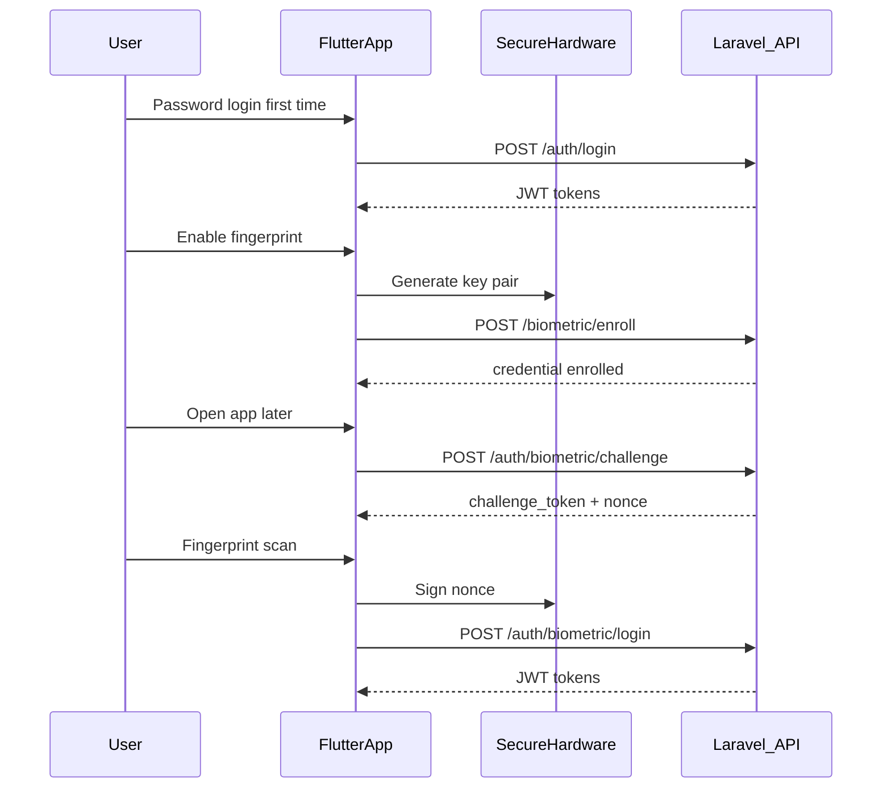

# PRD: Customer Biometric (Fingerprint) Login

> **Status:** Implemented  
> **Last updated:** 2026-07-02  
> **Related:** `CustomerBiometricService`, `CustomerBiometricController`, `tests/Feature/CustomerBiometricAuthApiTest.php`

---

## Problem / context

Customers must enter phone + password every time they open the Flutter wallet app. Mobile fintech apps typically offer fingerprint / Face ID for **returning users on a trusted device**, while keeping password + OTP for first login, new devices, and account recovery.

**Important:** The server never receives fingerprint data. The phone's biometric sensor only unlocks a **private key stored in secure hardware** (Android Keystore / iOS Secure Enclave). The server stores the matching **public key** and verifies a **signed challenge** on each biometric login.

Affected: **customers** (Flutter app), **backend** (new APIs + device registry), **QA** (PHPUnit simulates signatures — no fingerprint hardware in CI).

---

## Goals & non-goals

### Goals

- Enroll a device for biometric login after successful password login (or registration).
- Biometric login: challenge → sign nonce → verify signature → issue JWT pair (same shape as password login).
- List and revoke enrolled devices from the app.
- Audit trail: `biometric_enrolled`, `biometric_login`, `biometric_revoked` customer events.
- Idempotent enroll per `(customer_id, device_id)`; replay-protected challenges (single-use, 60s TTL).
- PHPUnit feature tests + Postman collection.

### Non-goals (v1)

- Sending raw fingerprint templates to the server (never).
- WebAuthn / passkeys (future v2).
- Biometric login on a new device without prior password login.
- Replacing password reset / OTP flows.
- NestJS AuthenticationService parity in v1 (Laravel `CustomerAuth` only).
- Ledger / wallet balance changes.

---

## How it works (easy flow)

### Phase A — First time (password required)

1. Customer logs in with **phone + password** → receives JWT.
2. Customer taps **Enable fingerprint login** in the Flutter app.
3. App generates a **key pair** in secure hardware (private key never leaves the chip).
4. App calls `POST /biometric/enroll` with `device_id`, `platform`, and `public_key`.
5. Server stores the public key → device is trusted for biometric login.

### Phase B — Next app open (biometric only)

1. App calls `POST /auth/biometric/challenge` with `device_id`.
2. Server returns `challenge_token`, `nonce`, and `expires_at`.
3. Customer scans fingerprint → app signs the **nonce bytes** with the private key (unlocked by biometric).
4. App calls `POST /auth/biometric/login` with `device_id`, `challenge_token`, and `signature`.
5. Server verifies signature → returns JWT (same as password login).



---

## Users & permissions

| Role | Action | Auth |
|------|--------|------|
| Customer | Enroll, list devices, revoke, disable | Customer JWT (`customer.jwt`) |
| Customer | Request challenge, biometric login | Public (no JWT) |

Same account status rules as password login (`authLoginBlockReason()`).

---

## Functional requirements

| ID | Requirement |
|----|-------------|
| FR1 | `POST /api/v1/customer/biometric/enroll` — authenticated; accepts `device_id`, `device_name`, `platform` (`ios`/`android`), `public_key` (PEM); upserts active credential |
| FR2 | `GET /api/v1/customer/biometric/devices` — list active enrolled devices |
| FR3 | `DELETE /api/v1/customer/biometric/devices/{id}` — revoke credential |
| FR4 | `POST /api/v1/customer/biometric/disable` — revoke by `device_id` |
| FR5 | `POST /api/v1/customer/auth/biometric/challenge` — public; returns `challenge_token`, `nonce`, `expires_at` |
| FR6 | `POST /api/v1/customer/auth/biometric/login` — public; verify signature; return standard auth response |
| FR7 | Challenge single-use, expires in 60 seconds (configurable) |
| FR8 | Max 5 active devices per customer; oldest auto-revoked when limit exceeded (configurable) |
| FR9 | Successful login updates `last_used_at` and logs `biometric_login` event |
| FR10 | Password change confirm revokes all biometric devices |
| FR11 | Account delete revokes all biometric devices |

---

## API contract

### Enroll (authenticated)

```
POST /api/v1/customer/biometric/enroll
Authorization: Bearer <access_token>

{
  "device_id": "550e8400-e29b-41d4-a716-446655440000",
  "device_name": "Ahmed's Pixel 8",
  "platform": "android",
  "public_key": "-----BEGIN PUBLIC KEY-----\n...\n-----END PUBLIC KEY-----"
}
```

### Challenge (public)

```
POST /api/v1/customer/auth/biometric/challenge
{ "device_id": "550e8400-..." }

→ 200 {
  "challenge_token": "<encrypted>",
  "nonce": "<base64url raw nonce bytes>",
  "expires_at": "2026-07-02T12:01:00Z"
}
```

### Biometric login (public)

```
POST /api/v1/customer/auth/biometric/login
{
  "device_id": "550e8400-...",
  "challenge_token": "<from challenge>",
  "signature": "<base64url ECDSA/RSA-SHA256 signature over raw nonce bytes>"
}

→ 200 { token, refresh_token, expires_in, customer, profile_completed, ... }
```

### List / revoke (authenticated)

```
GET    /api/v1/customer/biometric/devices
DELETE /api/v1/customer/biometric/devices/{credentialId}
POST   /api/v1/customer/biometric/disable   { "device_id": "..." }
```

---

## Money & data rules (fintech)

- No ledger postings; wallet balance unchanged.
- Store **public key only** — never private key, never fingerprint data.
- Signature algorithms: **ES256** (EC P-256, mobile default) or **RS256** (auto-detected from key type).
- `challenge_token` encrypted server-side (`BiometricChallengeCipher`).
- Idempotent enroll: same `device_id` updates public key and `enrolled_at`.
- Rate-limit challenge: 10 requests/min per `device_id` + IP (configurable).

---

## Edge cases & failure handling

| Case | Expected |
|------|----------|
| Unknown `device_id` | 401 Invalid credentials |
| Revoked device | 401 |
| Expired or reused `challenge_token` | 422 |
| Invalid signature | 401 |
| Customer suspended/inactive | 401 |
| Enroll without JWT | 401 |
| 6th device enroll | Oldest device auto-revoked (default) |
| Password changed | All devices revoked |
| OS biometrics disabled | Client falls back to password (no API call) |

---

## Configuration

| Env var | Default | Description |
|---------|---------|-------------|
| `BIOMETRIC_ALGORITHM` | `ES256` | Default algorithm for mobile keys |
| `BIOMETRIC_CHALLENGE_TTL` | `60` | Challenge expiry (seconds) |
| `BIOMETRIC_MAX_DEVICES` | `5` | Max active devices per customer |
| `BIOMETRIC_MAX_DEVICES_STRATEGY` | `revoke_oldest` | or `reject` |
| `BIOMETRIC_CHALLENGE_RATE_LIMIT` | `10` | Max challenges per window |
| `BIOMETRIC_CHALLENGE_RATE_DECAY` | `60` | Rate limit window (seconds) |

---

## Database

Table: `customer_biometric_devices`

| Column | Notes |
|--------|-------|
| `id` | UUID credential id |
| `customer_id` | FK → customers |
| `device_id` | Client install UUID |
| `device_name`, `platform` | Display metadata |
| `public_key` | PEM |
| `algorithm` | `ES256` or `RS256` |
| `status` | `active` / `revoked` |
| `enrolled_at`, `last_used_at`, `revoked_at` | Timestamps |

Unique: `(customer_id, device_id)`.

---

## Flutter responsibilities (external app)

| Step | Package / action |
|------|------------------|
| Check sensor | `local_auth` |
| Generate keys | Platform keystore with biometric protection |
| Enroll UI | After password login → settings toggle |
| Login UI | Fingerprint button if enrolled `device_id` exists |
| Sign challenge | Decode `nonce` from base64url → sign raw bytes → base64url signature |
| Fallback | Password login always available |

---

## Testing (no real fingerprint needed)

Backend tests use `BiometricTestKeyPair` (embedded RSA PEM) to sign challenges programmatically.

```bash
php artisan test tests/Feature/CustomerBiometricAuthApiTest.php
```

| ID | Scenario | Expected |
|----|----------|----------|
| T1 | Enroll after login | 201 + DB row |
| T2 | Challenge issued | 200 + challenge_token + nonce |
| T3 | Biometric login | 200 + JWT |
| T4 | Bad signature | 401 |
| T5 | Expired challenge | 422 |
| T6 | Replay challenge | 422 on second use |
| T7 | Revoked device | 401 on challenge |
| T8 | Enroll without auth | 401 |
| T9 | Password change | All devices revoked |
| T10 | Max devices | Oldest revoked |
| T11 | Suspended customer | 401 |

Postman: run **Login → Enroll → Challenge → Biometric Login** folder (login pre-request script signs nonce with test private key).

---

## Success metrics

- Biometric login p95 < 500ms (excluding client biometric UI).
- Zero false accepts in security tests.

---

## Assumptions

- `device_id` is a stable UUID per app install, stored in secure storage.
- Flutter app is external to this repo.
- v1 implemented in Laravel `CustomerAuth` module only.
